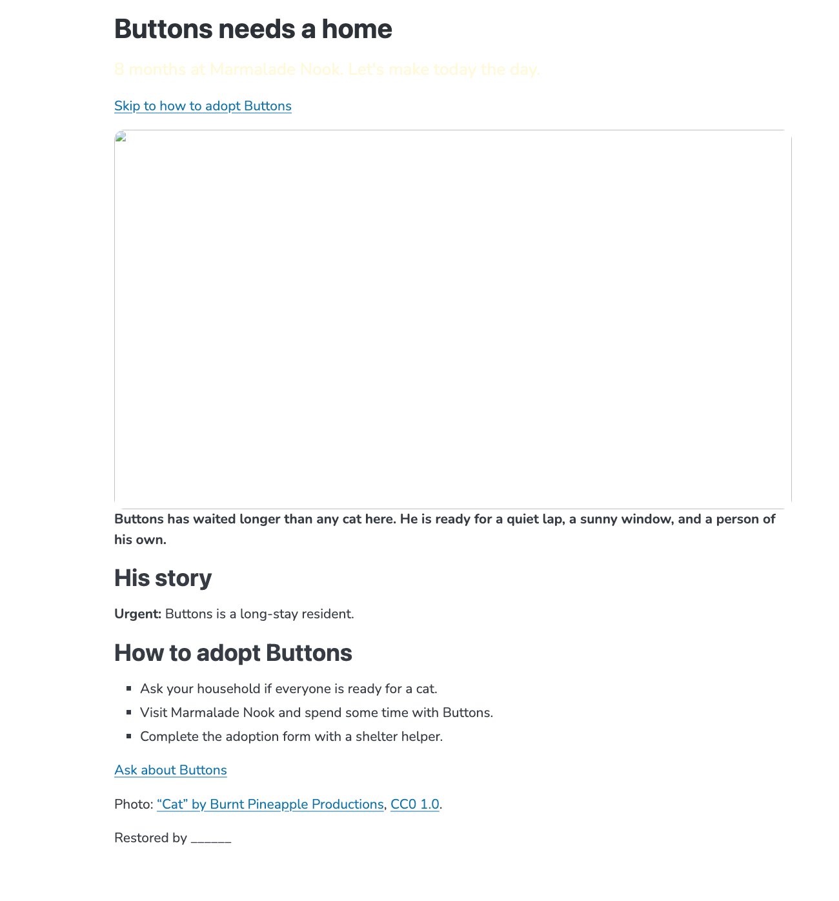
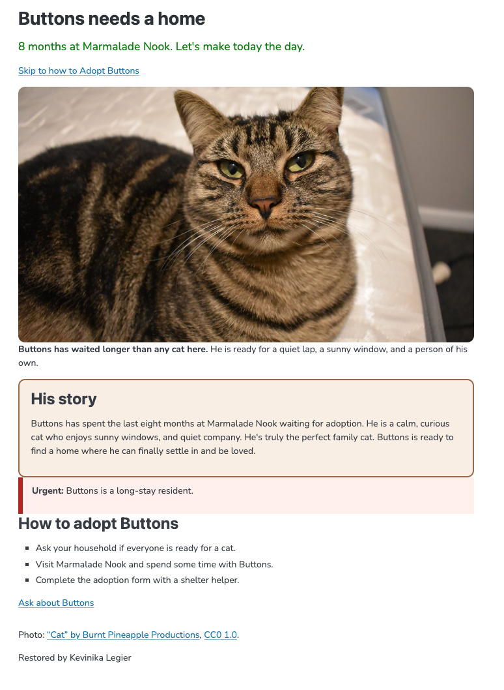

# Buttons' Rescue

The adoption page for Buttons, a long-stay cat at Marmalade Nook.
I inherited it broken, filed every problem as an issue, and fixed it
one commit at a time.

## Before and after

## What I fixed

- I fixed the image bug so that it would be visible on the webpage.
- Made the tagline color darker and easier to read.
- Made the link functional.
- Added alt text to the photo.
- Fixed bugs in css.
- Added the story to the empty section.
- Added photo decription.
## Credits

Photo: "Cat" by Burnt Pineapple Productions, CC0 1.0.
Live page: https://KevinikaL.github.io/buttons-rescue/
